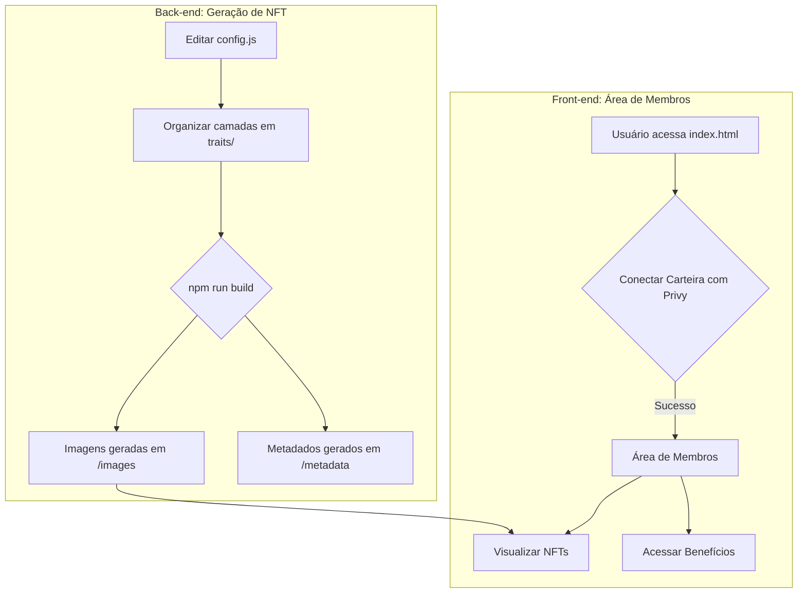

# NFT Collection Generator & Members Area

## Visão Geral (PT-BR)

Este projeto tem duas funcionalidades principais:

1.  **Gerador de Coleção de NFT**: Um conjunto de scripts Node.js que gera coleções de NFTs a partir de camadas de imagens e uma configuração de atributos (traits).
2.  **Área de Membros com Privy**: Uma interface web segura para detentores de NFTs, com autenticação via carteira Web3 usando o **[Privy](https://privy.io/)**.

### Sumário

- **[Como Funciona](#como-funciona)**
- **[Diagrama (Mermaid)](#diagrama-mermaid)**
- **[Getting Started](#getting-started)**
- **[Uso da Área de Membros](#uso-da-área-de-membros)**
- **[Uso do Gerador de NFT](#uso-do-gerador-de-nft)**
- **[Estrutura de Arquivos](#estrutura-de-arquivos)**
- **[Contributing](#contributing)**
- **[License](#license)**

## Como Funciona

O projeto combina um back-end para geração de arte e metadados de NFT com um front-end para engajamento da comunidade.

1.  **Geração de NFT**:
    -   Edite `config.js` para definir o tamanho da coleção, metadados e a ordem dos atributos.
    -   Organize as imagens (PNGs) em pastas dentro de `traits/`.
    -   Execute `npm run build` para gerar as imagens e os metadados JSON.
2.  **Área de Membros**:
    -   A página `index.html` atua como um portal seguro.
    -   Os usuários conectam suas carteiras Web3 (MetaMask, etc.) através do Privy para se autenticar.
    -   Uma vez autenticados, os usuários podem ver seus NFTs da coleção, acessar benefícios exclusivos e interagir com a comunidade.

## Diagrama (Mermaid)



## Getting Started

### Pré-requisitos

- [Node.js e npm](https://docs.npmjs.com/downloading-and-installing-node-js-and-npm)
- Um servidor web local para evitar erros de CORS ao testar a área de membros. Recomendamos o [Live Server](https://marketplace.visualstudio.com/items?itemName=ritwickdey.LiveServer) para VS Code ou executar `python -m http.server` no diretório do projeto.

### Instalação

1.  Clone o repositório:
    ```sh
    git clone https://github.com/manuelpires/nft-collection-generator.git
    ```
2.  Entre no diretório e instale as dependências:
    ```sh
    cd nft-collection-generator
    npm install
    ```

## Uso da Área de Membros

A área de membros é o ponto de entrada principal para sua comunidade.

### Executando Localmente

1.  **Gere as imagens de amostra**:
    ```sh
    npm run build
    ```
2.  **Inicie um servidor web local**:
    - Abra o `index.html` com a extensão Live Server do VS Code.
    - Ou execute `python -m http.server` e acesse `http://localhost:8000` no seu navegador.

### Funcionalidades

-   **Autenticação Segura**: Login com carteiras Web3, gerenciado pelo Privy. O App ID já está pré-configurado.
-   **Visualização de NFTs**: Após o login, os usuários veem os NFTs que possuem (atualmente, usa dados de mock em `privy-auth.js`).
-   **Benefícios Exclusivos**: Seções para exibir os benefícios de ser um detentor de NFT.

### Configuração para Produção

O sistema de autenticação (`privy-auth.js`) já está configurado com um App ID do Privy e um fallback para um modo de simulação (mock) se o SDK do Privy não carregar.

Para conectar com dados reais da blockchain, você precisará modificar `privy-auth.js` para buscar os NFTs de um usuário real em vez de usar o array `mockNFTData`.

**Opções para buscar NFTs:**

1.  **API do Privy**:
    ```javascript
    const nfts = await privy.user.wallet.getNFTs();
    ```
2.  **Serviços de API (Alchemy, Moralis)**:
    ```javascript
    const response = await fetch(`https://eth-mainnet.g.alchemy.com/v2/YOUR-API-KEY/getNFTs/?owner=${walletAddress}`);
    const nfts = await response.json();
    ```

## Uso do Gerador de NFT

Use os scripts para criar sua coleção de arte e metadados.

### Testar a Configuração

Verifique se o seu arquivo `config.js` está correto:
```sh
npm test
```

### Gerar a Coleção

Execute o script principal para gerar as imagens e os metadados:
```sh
npm run build
```
Os arquivos serão salvos nos diretórios `images/` e `metadata/`.

### Outros Scripts

-   **`npm run update-base-uri`**: Atualiza o URI base das imagens em todos os arquivos de metadados.
-   **`npm run create-gif`**: Cria um GIF animado a partir das imagens geradas.
-   **`npm run calculate-hashes`**: Calcula o hash SHA-256 de cada imagem.

## Estrutura de Arquivos

```
/
├── index.html          # Área de membros (requer login com Privy)
├── privy-auth.js       # Lógica de autenticação do Privy
├── config.js           # Configuração do gerador de NFT
├── index.js            # Script principal do gerador de NFT
├── traits/             # Diretório para as camadas de imagem
├── images/             # Saída das imagens geradas
├── metadata/           # Saída dos metadados gerados
└── package.json
```

## Contributing

Contribuições são bem-vindas! Sinta-se à vontade para abrir uma issue ou enviar um pull request.

1.  Fork o Projeto
2.  Crie sua Feature Branch (`git checkout -b feature/AmazingFeature`)
3.  Commit suas Mudanças (`git commit -m 'Add some AmazingFeature'`)
4.  Push para a Branch (`git push origin feature/AmazingFeature`)
5.  Abra um Pull Request

## License

Distribuído sob a Licença MIT. Veja `LICENSE` para mais informações.